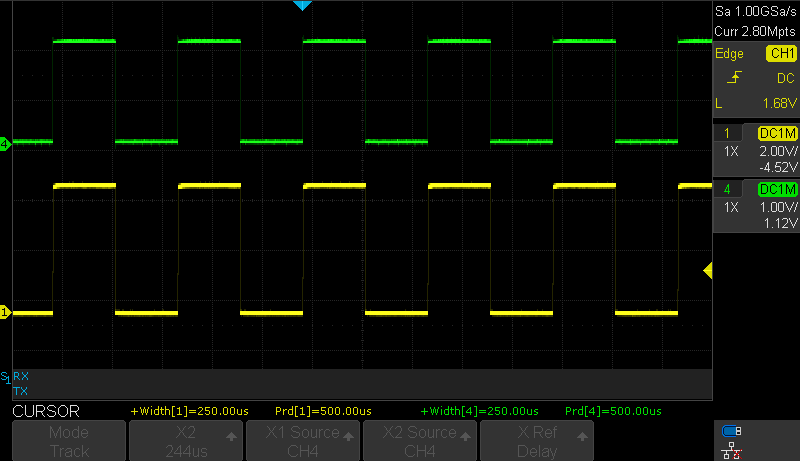

# Analog Comparator (AC) in three different modes using the AVR64DD32 microcontroller using MCC Melody

 The repository contains three MPLAB® X projects:
1.  [Analog Signal Pulse Duration Measurement](#1-analog-signal-pulse-duration-measurement) - This code example shows an implementation of duration and frequency measurement for an analog input signal, with minimal usage of the microcontroller (MCU) power.
2.  [Level Crossing Detector](#2-level-crossing-detector) - This code example monitors an analog input signal and compares it to a fixed voltage. Then, it notifies the user via an interrupt and an output pin every time the input signal crosses the fixed voltage level.
3.  [Preventing False Spike Detection](#3-preventing-false-spike-detection) - This code example demonstrates the hysteresis features of the AC module that help avoid the frequent toggling of the AC when the positive input oscillates close to the negative input level.

## Related Documentation

More details and code examples on the AVR64DD32 can be found at the following links:

- [AVR64DD32 Product Page](https://www.microchip.com/wwwproducts/en/AVR64DD32)
- [AVR64DD32 Code Examples on GitHub](https://github.com/microchip-pic-avr-examples?q=AVR64DD32)
- [AVR64DD32 Project Examples in START](https://start.atmel.com/#examples/AVR64DD32CuriosityNano)

## Software Used

- [MPLAB® X IDE](http://www.microchip.com/mplab/mplab-x-ide) v6.00 or newer
- [MPLAB® XC8](http://www.microchip.com/mplab/compilers) v2.36 or newer
- [AVR-Dx Series Device Pack](https://packs.download.microchip.com/) v2.1.152 or newer

## Hardware Used

- The AVR64DD32 Curiosity Nano Development Board is used as a test platform.
   
- Signal Generator
- Oscilloscope

## Operation

To program the Curiosity Nano board with this MPLAB® X project, follow the steps provided in the [**"How to program Curiosity Nano Board"**](#how-to-program-curiosity-nano-board) chapter.  

## 1. Analog Signal Pulse Duration Measurement

This application shows an implementation of the duration and frequency measurement for an analog input signal, with minimal usage of an MCU power. It uses the Event System (EVSYS) to route the signals from the AC output through an Event Channel to the Timer Counter B (TCB) Event Input. For this to happen, the EVSYS must be configured properly.

### 1.1 Setup 

The following configurations must be made for this project:

- CPU clock frequency is 4 MHz
- Configure the PD2 as an analog input and the PA7 as a digital output
- VREF
  - AC0 voltage reference at 2.048 V
  - AC0 voltage reference: enabled
- AC0
  - Positive input - pin 0
  - Negative input - Digital-to-Analog Converter (DAC) voltage reference is used for the negative input
  - DAC voltage reference is 0.8V
  - AC0: enabled
  - AC0 output: enabled
- TCB0
  - Input Capture Frequency and Pulse-Width Measurement mode
  - Prescaler CLK_PER/2
  - Run Standby: enabled
  - Enable Event Input Capture
  - Enable Capture/Timeout Interrupt
- Event System
  - AC0 out linked to Event Channel 0
  - TCB uses Event Channel 0
- Oscilloscope 
  - CH4 connected to PD2
  - CH1 connected to PA7
- Signal Generator
  - Connected to PD2

| Pin | Configuration  |
| :-: | :------------: |
| PD2 |  Analog Input  |
| PA7 | Digital Output |

### 1.2 Demo

The application will be able to measure the input signal pulse and period, and the AC will provide an output signal that switches when the input signal crosses the voltage reference.

To visualize the `signal_period` and `signal_pulse` variables values, the user needs to add the following instruction at the end of the `if` statement:
` asm("NOP");`.

Then, the user can enable a breakpoint on this line and visualize the signal period and the signal pulse inside the Variables window.

- The image below presents the AC output signal, for a square input signal.
 

- To visualize the results inside the `signal_period` and `signal_pulse` variables, enable a breakpoint on the `asm("NOP");` code line. Then, click on the **Debug Main Project** button, as presented below.
 

- The values for an 80% duty cycle signal provided on the AC input the values measured using the timer are presented below.
 

- The input signal (green) and the output signal (yellow) are presented in the oscilloscope capture below.
 

- For a triangular input signal, the oscilloscope capture can be observed below.
 

- The voltage reference selected for the DAC (0.8V) on the negative input of the AC can be observed in the image below. The AC output goes HIGH/LOW when the input voltage crosses ~0.8V.
 

### 1.3 Summary

This project shows how to use the AC in conjunction with other peripherals such as VREF, DAC, EVSYS, and TCB to measure the period and pulse width of an analog input signal. 
[Back to top](#analog-comparator-ac-in-three-different-modes-using-the-avr64dd32-microcontroller-using-mcc-melody) 

## 2. Level Crossing Detector

This example shows a basic initialization and a setup for the AC peripheral. The application monitors an analog input signal, compares it to a fixed voltage, and notifies the user via an interrupt and an output pin every time the input signal crosses the fixed voltage level.
The comparator can be used to monitor the battery voltage (or any other DC level).

### 2.1 Setup 

The following configurations must be made for this project:

- CPU clock frequency is 4 MHz
- Configure PD2 as analog input
- Configure PA7 as digital output
- VREF
  - AC0 voltage reference at 2.048 V
  - AC0 voltage reference: enabled
- AC0
  - Positive input - pin 0
  - Negative input - DAC voltage reference is used for the negative input
  - DAC voltage reference is 0.8V
  - AC0: enabled
  - AC0 output: enabled
- Oscilloscope 
  - CH4 connected to PD2
  - CH1 connected to PA7
- Signal Generator
  - Connected to PD2

| Pin | Configuration  |
| :-: | :------------: |
| PD2 |  Analog Input  |
| PA7 | Digital Output |

### 2.2 Demo

In this demo, the AC output will go high (5V) when the input signal is above the threshold (0.8V) and low (0V) when the input signal is below the threshold. In the following figures, the green signal is the input signal, and the yellow signal is the output of the AC.

- Sine wave as input:
   

- Triangle wave as input:
   

- Square wave (80% duty cycle) as input:
   

### 2.3 Summary

This project shows a basic configuration for the AC peripheral. The application monitors an analog input signal and compares it to a fixed voltage. An interrupt triggers, and a pin toggles every time the input signal crosses the fixed voltage level. 
[Back to top](#analog-comparator-ac-in-three-different-modes-using-the-avr64dd32-microcontroller-using-mcc-melody) 

## 3. Preventing False Spike Detection

This example demonstrates the hysteresis features of the AC module that helps to avoid the frequent
toggling of the AC when the positive input oscillates close to the negative input level.  
This application is based on the [Level Crossing Detector](#2-level-crossing-detector) application and, additionally, it has the Hysteresis mode enabled.

### 3.1 Setup 

The following configurations must be made for this project:

- CPU clock frequency is 4 MHz
- Configure PD2 as analog input
- Configure PA7 as digital output
- VREF
  - AC0 voltage reference at 2.048 V
  - AC0 voltage reference is enabled
- AC0
  - Positive input - pin 0
  - Negative input - DAC voltage reference is used for the negative input
  - DAC voltage reference is 0.8 V
  - Enable medium hysteresis
  - AC0 is enabled
  - AC0 output is enabled
- Oscilloscope 
  - CH4 connected to PD2
  - CH1 connected to PA7
- Signal Generator
  - Connected to PD2
  
| Pin | Configuration  |
| :-: | :------------: |
| PD2 |  Analog Input  |
| PA7 | Digital Output |

### 3.2 Demo

This application shows the implementation of hysteresis in a voltage level detector application.

- The figure below presents both the green input and the yellow output signals of this application. There is no noticeable difference between the signals displayed here (with medium hysteresis enabled) and the signals provided for the basic Level Crossing Detector. To observe the differences, the user needs to zoom in to visualize the rising/falling edges of the signals.
 

A comparison between the without-hysteresis and with-hysteresis application signals is presented below.

- The image below shows the AC configuration without the hysteresis activated, resulting in a spike on the output signal. When the green input signal oscillates around the threshold value of the AC, the yellow output signal will switch more often, generating spikes.
 

- The image below shows the AC configuration with the hysteresis activated, preventing unwanted spikes on the output signal. Again, the green input signal oscillates around the threshold, but there are no spikes generated on the yellow output signal.
 

### 3.3 Summary

This project shows how to use the hysteresis when building a voltage level detector application using the AC. 

[Back to top](#analog-comparator-ac-in-three-different-modes-using-the-avr64dd32-microcontroller-using-mcc-melody)

##  How to program Curiosity Nano Board

This chapter demonstrates how to use the MPLAB® X IDE to program an AVR® device with an Example_Project.X. This can be applied to any other project.

1.  Connect the board to the PC.

2.  Open the Example_Project.X project in MPLAB X IDE.

3.  Set the Example_Project.X project as main project.
     Right click the project in the **Projects** tab and click **Set as Main Project**.
     

4.  Clean and build the Example_Project.X project.
     Right click on the **Example_Project.X** project and select **Clean and Build**.
     

5.  Select **AVRxxxxx Curiosity Nano** in the Connected Hardware Tool section of the project settings:
     Right click the project and click **Properties**.
     Click the arrow under the Connected Hardware Tool.
     Select **AVRxxxxx Curiosity Nano** (click the **SN**), click **Apply** and then click **OK**.
     

6.  Program the project to the board.
     Right click the project and click **Make and Program Device**.
     

 

- [Back to 1. Analog Signal Pulse Duration Measurement](#1-analog-signal-pulse-duration-measurement) 
- [Back to 2. Level Crossing Detector](#2-level-crossing-detector) 
- [Back to 3. Preventing False Spike Detection](#3-preventing-false-spike-detection) 
- [Back to top](#analog-comparator-ac-in-three-different-modes-using-the-avr64dd32-microcontroller-using-mcc-melody) 
